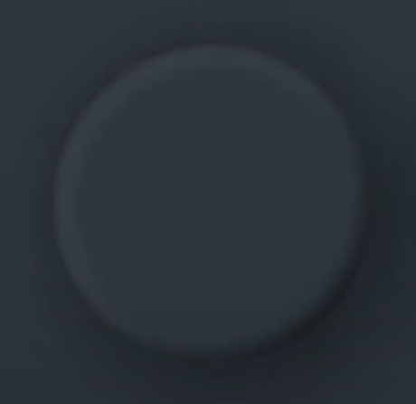

# Digital Clock

[https://youtu.be/zmoVEilswsw?si=KtNTwetXEM-jdram](https://youtu.be/zmoVEilswsw?si=KtNTwetXEM-jdram)

# 입체감 있는 배경

<br>

- `inset(top right bottom left)` : 요소의 내부 여백을 설정함. top, right, bottom, left의 축약 스타일 속성이다.

  ```css
  // example
  top: 20px;
  right: 50px;
  bottom: 20px;
  left: 50px;

  => inset: 20px 50px; // 이와 같이 축약할 수 있음
  ```

- 그림자를 안쪽으로 이동시켜 안쪽에 입체감을 준다.
- `box-shadow: h-shadow v-shadow blur spread color inset`
  - syntax value가 2개 일 때: **x와 y축** 길이 (-는 왼/위, +는 오/아래)
  - 3개 일 때: 3번 째 값은 **blur-radius** 흐릿한 정도
  - 4개 일 때: 4번 째 값은 **spread-radius** 그림자 크기
  - inset은 선택사항

```css
#secDots::before,
#minDots::before,
#hrDots::before {
  content: "";
  position: absolute;
  inset: -20px; // 네 가장자리에 -20px의 여백을 설정
  border-radius: 50%;
  **box-shadow: 25px 25px 75px rgba(0, 0, 0, 0.25),
    10px 10px 70px rgba(0, 0, 0, 0.25),
    inset 5px 5px 10px rgba(0, 0, 0, 0.5),
    inset 5px 5px 20px rgba(255, 255, 255, 0.2),
    inset -5px -5px 15px rgba(0, 0, 0, 0.75);**
}
```

<br>

# dial

## JS

1초,분에 해당하는 부분에 다이얼을 집어 넣을 수 있게 loop을 이용하여 각 각도마다 html 코드를 추가한다.

className에 active를 추가하여 현재 활성화 된 dial을 스타일링 한다.

```jsx
var secondsDots = "";
for (var i = 1; i < 61; i++) {
  var rotation = i * 6; // 360도로
  if (i === seconds) {
    secondsDots +=
      '<div class="dot active" style="transform:rotate(' +
      rotation +
      'deg)"></div>';
  } else {
    secondsDots +=
      '<div class="dot" style="transform:rotate(' + rotation + 'deg)"></div>';
  }
}
```

<br>

## Style

- `transform-origin`: 요소 transform의 기준점을 정한다. 기본값은 center(50%, 50%)
  - single <length> or<%> value: horizontal offset
- 그림자를 단계적으로 설정해서 led 번지는 효과 주기
  ```css
  #secDots .active.dot,
  #minDots .active.dot,
  #hrDots .active.dot {
    background: var(--clr);
    **box-shadow: 0 0 10px var(--clr), 0 0 20px var(--clr), 0 0 30px var(--clr);**
  }
  ```
- 5의 배수로 포인트 다이얼 추가
  ```css
  #secDots .dot:nth-child(5n + 5),
  #minDots .dot:nth-child(5n + 5) {
    width: 20px;
  }
  ```
